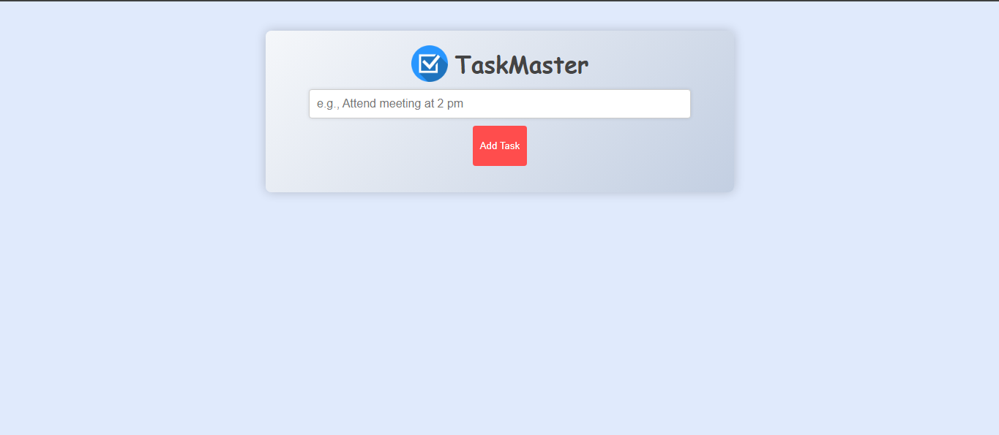
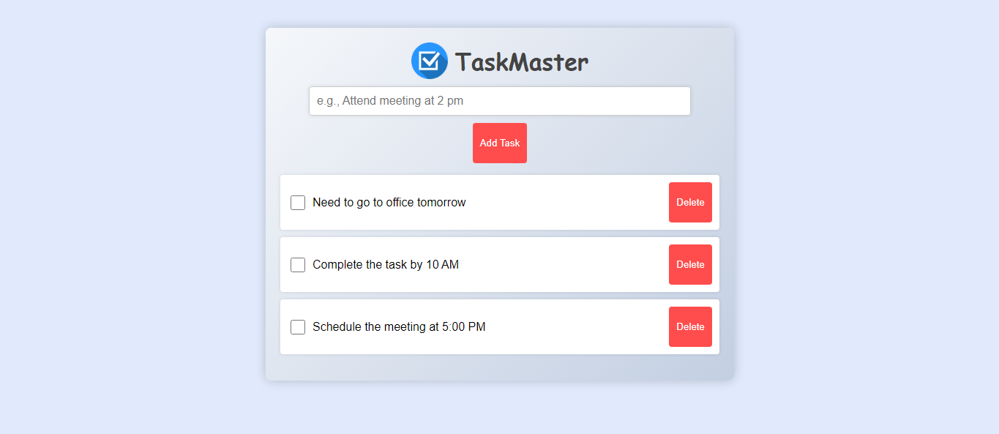

# TaskMaster

A privacy‑focused, offline‑first task management app built with React 18 + TypeScript + IndexedDB. All data stays on the user's device (no accounts, no tracking, no external APIs).

## Table of Contents
- [Features](#features)
- [Tech Stack](#tech-stack)
- [Architecture](#architecture)
- [Privacy & Offline Storage](#privacy--offline-storage)
- [Screenshots](#screenshots)
- [Installation](#installation)
- [Available Scripts](#available-scripts)
- [Project Structure](#project-structure)
- [Development Notes](#development-notes)
- [Accessibility](#accessibility)
- [Testing](#testing)
- [Build & Deployment](#build--deployment)
- [Troubleshooting](#troubleshooting)
- [Roadmap](#roadmap)
- [Contributing](#contributing)
- [License](#license)

## Features
- Add, edit, delete tasks
- Priority levels (low / medium / high)
- Categories (work, personal, health, etc.)
- Optional due dates & tags (array)
- Completion tracking + stats (overdue, priority, category counts)
- IndexedDB persistence (no backend)
- Responsive UI (desktop + mobile nav)
- Accessible modals & skip link
- Theming via Tailwind utility classes
- Privacy Policy modal (no data leaves device)

## Tech Stack
| Layer | Libraries / Tools |
|-------|-------------------|
| UI | React 18, TypeScript, Tailwind CSS |
| Icons | react-icons (Feather set) |
| State / Data | Local component state + IndexedDB via `idb` |
| Build Toolchain | Create React App (react-scripts 5) |
| Notifications | react-toastify |
| Head Mgmt / SEO | react-helmet-async |
| PWA Pieces | Service worker registration + Workbox (caching strategy) |

## Architecture
High level:
1. Components render task data pulled from IndexedDB.
2. `db.ts` encapsulates all persistence (CRUD + aggregate stats).
3. UI triggers async functions -> await DB ops -> re-render with updated state.
4. No remote network calls; offline by design.

Data model (`Task`):
```ts
interface Task {
  id: number;
  text: string;
  description?: string;
  completed: boolean;
  priority: 'low' | 'medium' | 'high';
  category: 'work' | 'personal' | 'shopping' | 'health' | 'education' | 'other';
  dueDate?: string; // ISO date
  createdAt: string; // ISO
  updatedAt: string; // ISO
  tags: string[];
}
```

## Privacy & Offline Storage
- All task data lives in IndexedDB under the database `taskmaster-db`.
- No analytics, ads, cookies, tracking pixels, or external API calls.
- Clearing browser storage (IndexedDB) permanently removes tasks.
- You control your data; export/import (future roadmap) can extend portability.

## Screenshots



## Installation
```sh
git clone https://github.com/chetankumarpulipati/my-task-master.git
cd my-task-master
npm install
```

## Available Scripts
```sh
npm start        # Run dev server (http://localhost:3000)
npm test         # Run test watcher (Jest / React Testing Library)
npm run build    # Production build (outputs to /build)
npm run eject    # CRA eject (irreversible)
```

## Project Structure
```
src/
  App.tsx              # Root component + layout + privacy modal
  db.ts                # IndexedDB logic (CRUD + stats)
  components/          # UI components (tasks, forms, filters, stats)
  assets/images/       # App images & logos
  serviceWorkerRegistration.ts  # PWA service worker registration
  index.js / index.css  # Entry + global styles
```

## Development Notes
- TypeScript config uses `react-jsx` transform.
- Icons imported from `react-icons/fi`.
- IndexedDB indices: `priority`, `category`, `completed`, `dueDate`.
- Stats derived client-side to avoid premature optimization.
- No external state libs to keep footprint minimal.

## Accessibility
- Skip link for keyboard users.
- ARIA labels on interactive icons/buttons.
- Color contrast aimed at WCAG AA.
- Semantic headings & focus states.

## Testing
Basic testing scaffold via CRA:
```sh
npm test
```
Add tests in `src/*.test.{ts,tsx,js}` using React Testing Library.

## Build & Deployment
Create production build:
```sh
npm run build
```
Serve locally for verification:
```sh
npx serve -s build
```
Deploy options:
- Static hosting (Netlify, Vercel, GitHub Pages)
- Any CDN serving the `/build` directory

If using GitHub Pages, add a `homepage` field to `package.json` (e.g. `"https://username.github.io/my-task-master"`).

## Troubleshooting
| Issue | Fix |
|-------|-----|
| `react-scripts` not found | Reinstall: `npm install react-scripts@5.0.1` |
| Stale build after edits | Clear cache / delete `build/` then rebuild |
| Blank page | Check console for runtime errors (often bad import path) |
| Tasks not saving | Confirm browser allows IndexedDB / not in private mode |
| Type errors in `db.ts` | Ensure matching TypeScript version and clean install |

## Roadmap
- Task export/import (JSON)
- Search & tag filtering UI
- Drag & drop prioritization
- Optional encryption layer
- Theming (dark mode)
- Progressive Web App full offline caching refinements

## Contributing
1. Fork repo
2. Create feature branch: `git checkout -b feature/xyz`
3. Commit: `git commit -m "feat: add xyz"`
4. Push & open PR

Please keep PRs small & focused. Open an issue first for larger changes.

## License
MIT License. See `LICENSE` (add one if missing).

---
Made with React + care for user privacy.
